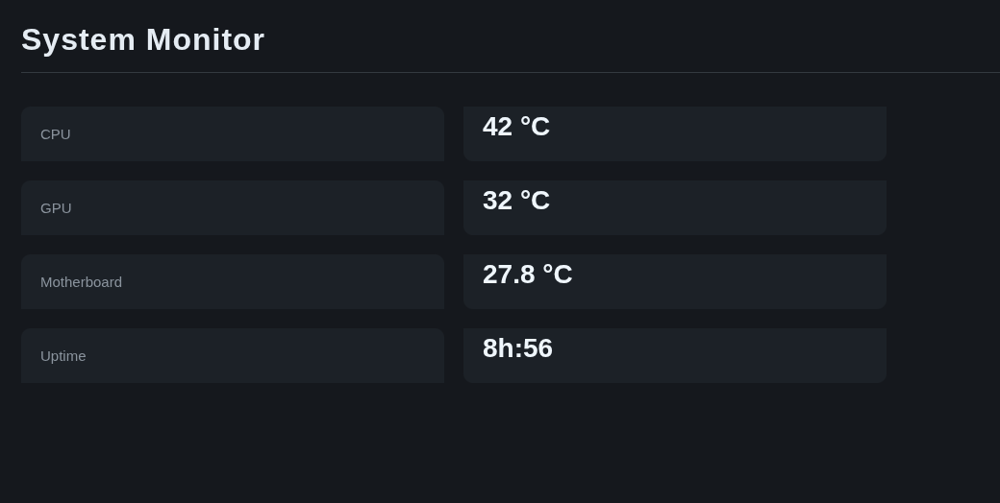

# System Monitor

A small system monitoring dashboard I made to monitor my own Linux machine.

The project reads hardware information directly from Linux and displays it through a simple web interface.

Currently, it monitors:

* CPU temperature
* GPU temperature
* Motherboard temperature
* System uptime

The main goal of this project is to practice working with **Linux system interfaces, Python, Flask, APIs and JavaScript**.



Author: d4vidlinux

## Technologies

* Python
* Flask
* HTML
* CSS
* JavaScript
* Linux `/sys` and `/proc`

## Project Structure

```text
System-Monitor/
├── app.py
├── system_functions.py
├── templates/
│   └── index.html
└── static/
    ├── script.js
    └── style.css
```

## How It Works

The Python backend reads information directly from Linux.

Temperature values are obtained through:

```text
/sys/class/hwmon/
```

while uptime is obtained from:

```text
/proc/uptime
```

Flask exposes the collected information through:

```text
/api/resources
```

The JavaScript frontend requests this endpoint every second and updates the dashboard.

In short:

```text
Linux
  ↓
Python
  ↓
Flask API
  ↓
JavaScript
  ↓
Dashboard
```

## Running

Install Flask:

```bash
pip install flask
```

Then run:

```bash
python3 app.py
```

Open:

```text
http://127.0.0.1:5000
```

The server also listens on `0.0.0.0:5000`, so the dashboard can be accessed through the machine's IP address from another device on the network.

## About the Hardware Paths

The project currently uses specific paths for my hardware:

```text
/sys/class/hwmon/hwmon2/temp1_input
/sys/class/hwmon/hwmon1/temp1_input
/sys/class/hwmon/hwmon0/temp1_input
```

These paths are dependent on the hardware and drivers of the machine.

Because of that, this project **isn't intended to be a universal system monitoring tool**. If someone wants to use it on another machine, the sensor paths will probably need to be changed.

This is intentional for the current version of the project.

Rather than trying to support every possible hardware configuration, I chose to work directly with the interfaces exposed by my own Linux system.

## API

The `/api/resources` endpoint returns the current information as JSON:

```json
{
    "cpu": 45.0,
    "gpu": 42.0,
    "motherboard": 38.0,
    "uptime": "2h:35"
}
```

## Current Status

This is a personal project and is still fairly simple.

There is no database, authentication, historical data or automatic hardware detection.

The project is mainly an experiment in connecting **Linux system information with a web interface**.

## Possible Improvements

If I decide to continue developing it, some possible additions are:

* CPU usage
* GPU usage
* RAM usage
* Disk usage
* Network information
* Process monitoring
* Temperature history
* Graphs
* Automatic sensor detection
* Better uptime formatting

