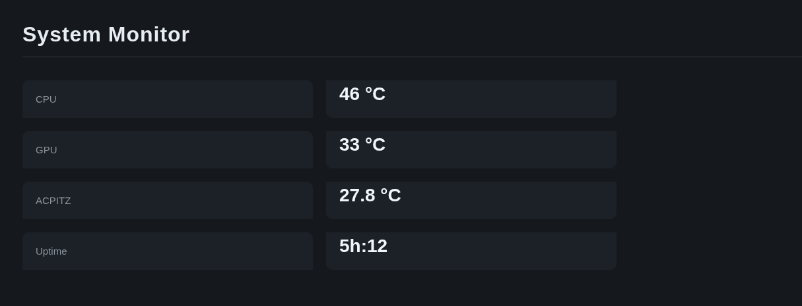

# Local System Monitor

A lightweight system monitoring dashboard built with **Python**, **Flask**, and **psutil**.

The application collects hardware information from the local Linux system and exposes it through a simple web dashboard and API.



## Features

* CPU temperature monitoring
* GPU temperature monitoring
* Motherboard temperature monitoring through `acpitz`
* System uptime monitoring
* REST API for system information
* Support for multiple CPU temperature sensors
* Support for multiple GPU sensor names
* Local web dashboard

## Requirements

* Python 3
* Linux
* Flask
* psutil

## Installation

Clone the repository:

```bash
git clone https://github.com/d4vidlinux/local-system-monitor.git
cd local-system-monitor
```

Install the dependencies:

```bash
pip install -r requirements.txt
```

## Usage

Start the application:

```bash
python3 app.py
```

The server will listen on:

```text
http://localhost:5000
```

Because the application runs with `host="0.0.0.0"`, it can also be accessed from other devices on the same network using the machine's local IP address.

## API

The system information is available through:

```text
GET /api/resources
```

Example response:

```json
{
    "cpu": 45.0,
    "acpitz": 38.0,
    "gpu": 42.0,
    "uptime": "3h:27"
}
```

### Available data

| Field    | Description                    |
| -------- | ------------------------------ |
| `cpu`    | CPU temperature                |
| `gpu`    | GPU temperature                |
| `acpitz` | Motherboard/system temperature |
| `uptime` | System uptime                  |

## Project Structure

```text
Local-System-Monitor/
├── app.py
├── system_functions.py
├── templates/
│   └── index.html
├── static/
│   └── script.js
│   └── style.css
├── images/
│   └── system_monitor.png
└── requirements.txt
```

### `app.py`

Contains the Flask application, routes, and API endpoint.

### `system_functions.py`

Contains the functions responsible for retrieving system information using `psutil` and Linux system files.

### `templates/`

Contains the HTML used by the dashboard.

### `static/`

Contains frontend resources such as CSS and JavaScript.

## Supported Sensors

The application checks several possible sensor names when searching for CPU temperatures:

```text
coretemp
k10temp
k8temp
```

For GPUs, it checks:

```text
amdgpu
nvidia
nouveau
i1915
xe
radeon
lima
panfrost
```

The exact sensors available depend on the hardware, drivers, and Linux kernel.

## Technologies

* **Python**
* **Flask**
* **psutil**
* **HTML**
* **CSS**
* **JavaScript**
* **Linux `/proc` filesystem**

## Author

**d4vidlinux**
